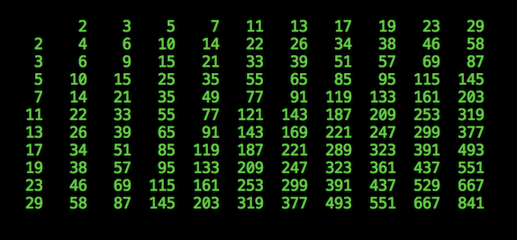

## Primes Table

Clojure Application that prints a multiplication table of the first N-primes

[](https://travis-ci.org/scotthaleen/primes-table) | [](https://github.com/scotthaleen/primes-table/releases/latest)
| [](https://github.com/scotthaleen/primes-table)

<p align="center">


</p>

### Installation

Download from the latest [release](https://github.com/scotthaleen/primes-table/releases/latest)


### Usage

```sh
$ java -jar primes-table-*-standalone.jar -h

Usage: primes-table [Options]
Options:
  -n, --num-primes N 10  number of primes to generate
  -h, --help
```

Example usage:

```sh
$ java -jar target/primes-table-*-standalone.jar -n 5

         2    3    5    7   11
    2    4    6   10   14   22
    3    6    9   15   21   33
    5   10   15   25   35   55
    7   14   21   35   49   77
   11   22   33   55   77  121
```


### Build

To build an executable jar, run:

```sh
$ lein uberjar
```

This will produce an executable jar in the `target` directory. <br />
Example: `target/primes-table-0.1.0-3671e74-standalone.jar`

### Test

```sh
$ lein test
```


### Interactive

This project is setup for for [Clojure Reloaded Workflow](http://thinkrelevance.com/blog/2013/06/04/clojure-workflow-reloaded)

From the **repl** the following options are available

- `(test)` execute tests
- `(go)` run application
- `(reset)` restarts the application
- `(stop)` shutdown the application

You can interact with the global system var `reloaded.repl/system`

```sh
$ lein repl

user=> (test)

6/6   100% [==================================================]  ETA: 00:00

Ran 6 tests in 0.166 seconds
10 assertions, 0 failures, 0 errors.
{:test 6, :pass 10, :fail 0, :error 0, :type :summary, :duration 165.869191}

user=> (go)
         2    3    5    7   11   13   17   19   23   29
    2    4    6   10   14   22   26   34   38   46   58
    3    6    9   15   21   33   39   51   57   69   87
    5   10   15   25   35   55   65   85   95  115  145
    7   14   21   35   49   77   91  119  133  161  203
   11   22   33   55   77  121  143  187  209  253  319
   13   26   39   65   91  143  169  221  247  299  377
   17   34   51   85  119  187  221  289  323  391  493
   19   38   57   95  133  209  247  323  361  437  551
   23   46   69  115  161  253  299  391  437  529  667
   29   58   87  145  203  319  377  493  551  667  841

user> (keys reloaded.repl/system)
(:primes :multiplication-table :app)

user> (stop)
:stopped
```


#### Dependencies Information

- [component](https://github.com/stuartsierra/component) to manage application state and lifecycle
- [tools.cli](https://github.com/clojure/tools.cli) for command line parsing
- [eastwood](https://github.com/jonase/eastwood) for linting
- [eftest](https://github.com/weavejester/eftest) for executing tests from the repl
- [reloaded.repl](https://github.com/weavejester/reloaded.repl) to support [reloaded workflow](http://thinkrelevance.com/blog/2013/06/04/clojure-workflow-reloaded)


Copyright © 2017  ☕
